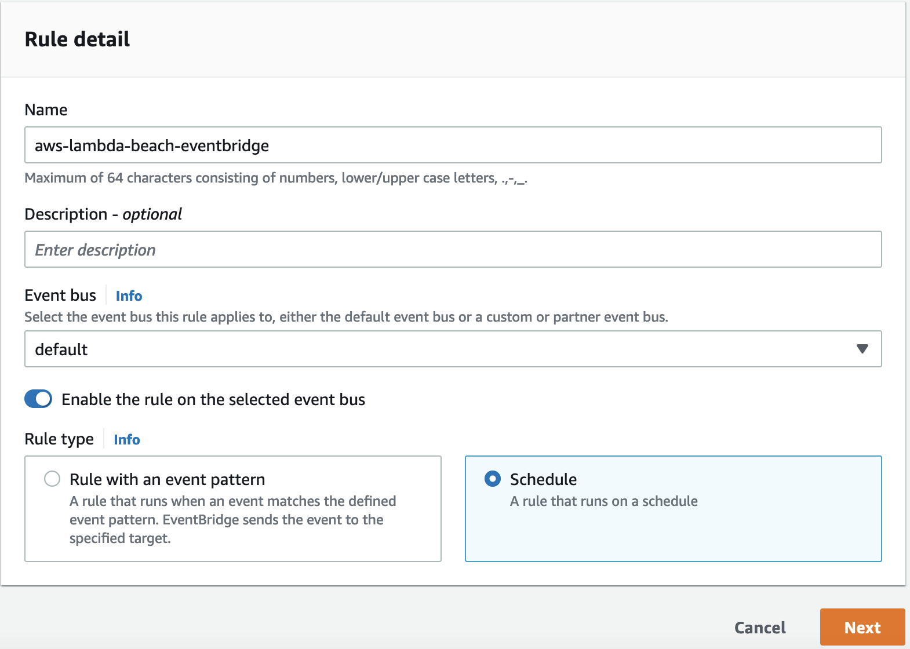
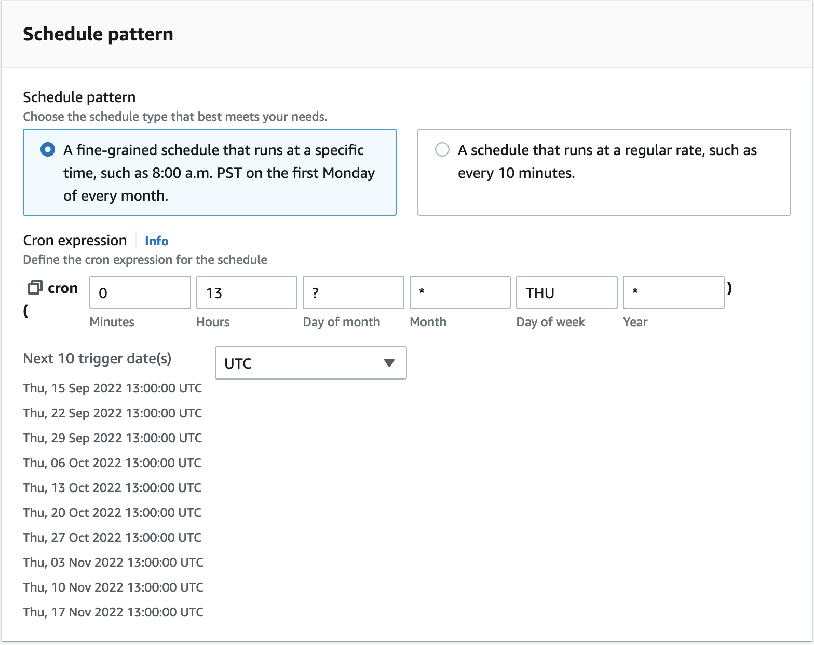
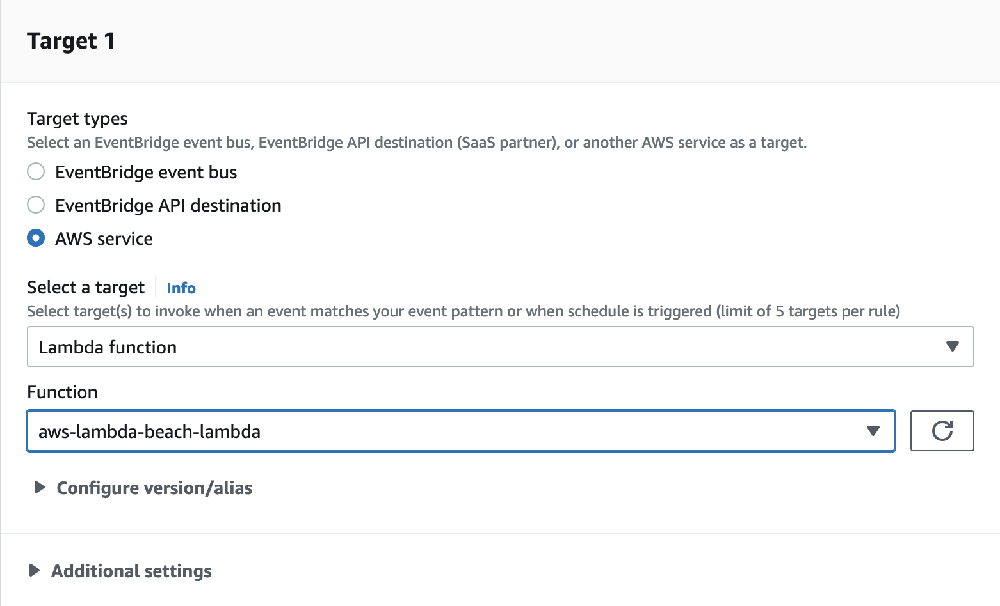
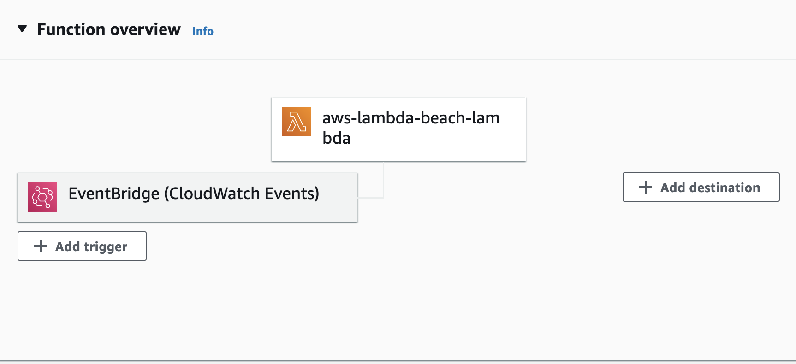
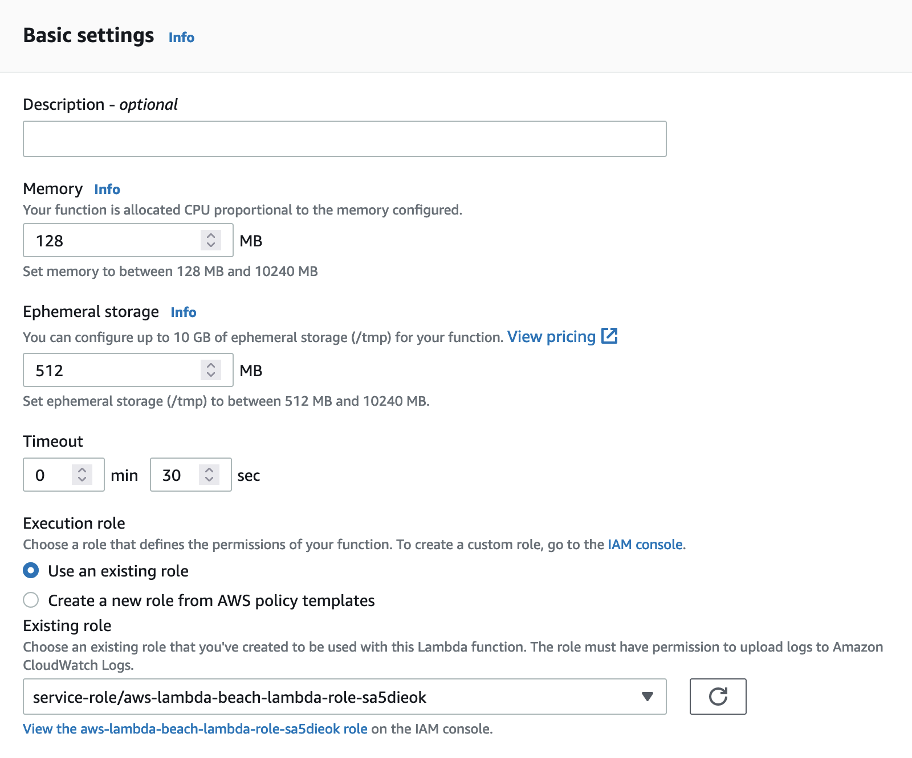
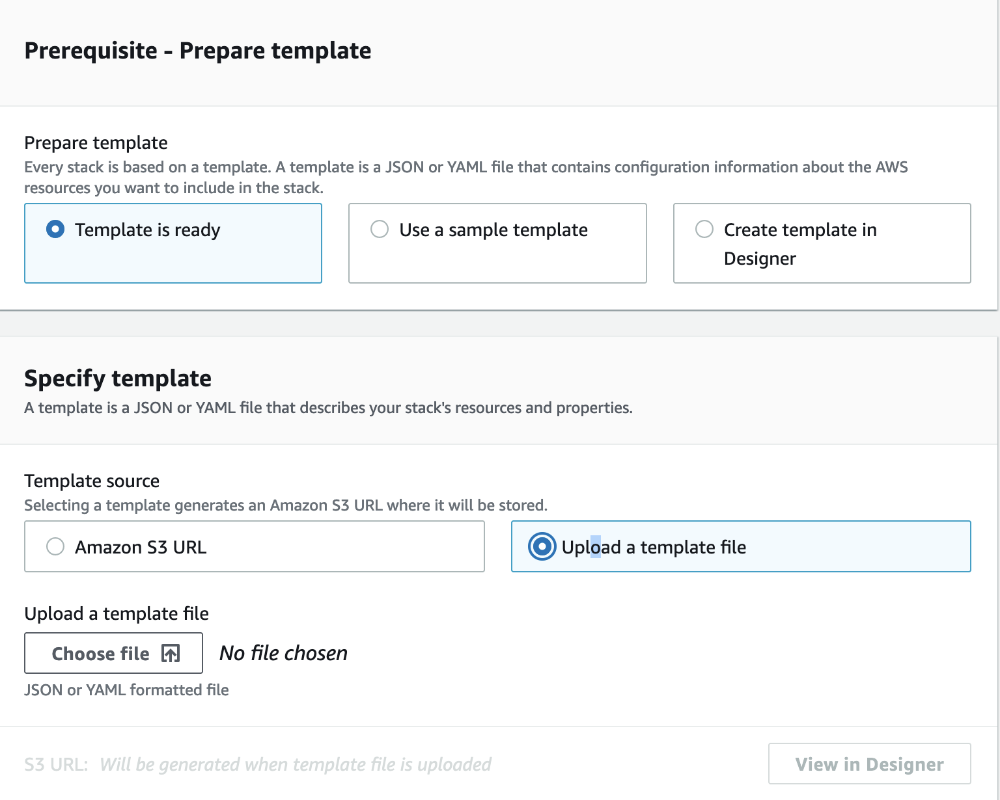
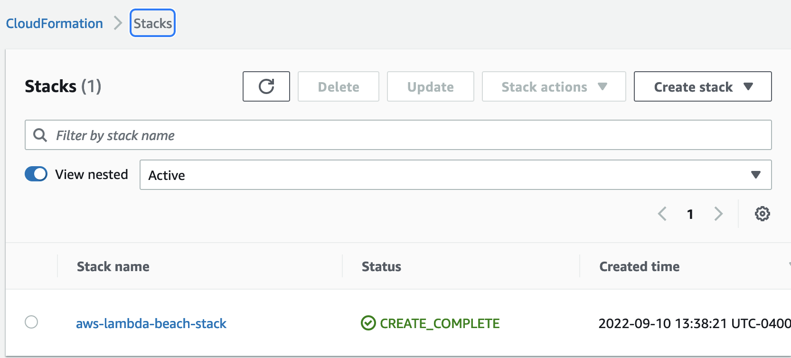

# AWS Lambda Beach


  
[](https://github.com/michaelwalkerfl/lambda-beach/actions/workflows/lambda.yml)


I want to know if it's going to rain or not each weekend so I can plan to go to the beach or read a book. This application runs on `AWS Lambda`. It will check the weather for the upcoming weekend and send an email informing whether it's raining or not. Maybe I should have named this whether-the-weather. It makes use of `AWS EventBridge` for task scheduling and `AWS CloudFormation` for *Infrastruture as Code* solution to run aws lambda in container stored in the `Elastic Container Registry`.

## Setting up

##### Clone the repository 

```
$ git clone https://github.com/michaelwalkerfl/lambda-beach.git
$ cd lambda-beach
```

## Go to the AWS Elastic Container Registry to create ECR container
`aws ecr get-login-password --region us-east-2 | docker login --username AWS --password-stdin 565567886531.dkr.ecr.us-east-2.amazonaws.com`

If you receive the following error:
```
Partial credentials found in env, missing: AWS_SECRET_ACCESS_KEY
Error: Cannot perform an interactive login from a non TTY device
```

This is because of credentials (most likely configured in ~/.aws/credentials) that are being used instead of perhaps what you have contained within your .env file.

If you are on a mac, try the following fix:
```
export AWS_ACCESS_KEY_ID={your_key_id_here}
export AWS_SECRET_ACCESS_KEY={your_secret_access_key_here}
export AWS_DEFAULT_REGION={your_default_region}
```

Before the docker image can be built, we need to modify the command AWS provides to pass build arguments to the CLI command AWS provides
```
docker build \
--build-arg WEATHER_API_KEY="{api_key_here}" \
--build-arg EMAIL_USER="{your@email.com}" \
--build-arg EMAIL_PASSWORD="{your_gmail_app_password}" \
-t aws-lambda-beach-ecr .
```

Then go back to the web page to copy the command to tag the container so it can be pushed to the repository
`docker tag aws-lambda-beach-ecr:latest 345634.dkr.ecr.us-east-2.amazonaws.com/aws-lambda-beach-ecr:latest`

Now push to the repository
`docker push 345634.dkr.ecr.us-east-2.amazonaws.com/aws-lambda-beach-ecr:latest`

Time to create the AWS Lambda function using the created container
1. Go back to AWS console, search - Lambda, go to AWS Lambda
2. Create function
3. Select container image
4. Copy URI from container within the Container Registry, paste in Lambda function creation screen
5. Click create function

If you need to make any changes to the code, you will need to rebuild your docker image passing the `--no-cache` argument
```
docker build --no-cache \
--build-arg WEATHER_API_KEY="{api_key_here}" \
--build-arg EMAIL_USER="{your@email.com}" \
--build-arg EMAIL_PASSWORD="{your_gmail_app_password}" \
-t aws-lambda-beach-ecr .
```

After build, tag again
`docker tag aws-lambda-beach-ecr:latest 345635.dkr.ecr.us-east-2.amazonaws.com/aws-lambda-beach-ecr:latest`

Then you need to push again
`docker push 345635.dkr.ecr.us-east-2.amazonaws.com/aws-lambda-beach-ecr:latest`

The AWS Lambda function will not automatically update, so we update it manually
``aws lambda update-function-code --function-name aws-lambda-beach-lambda --image-uri 345635.dkr.ecr.us-east-2.amazonaws.com/aws-lambda-beach-ecr:latest``

This is tedious to do manually, I'd suggest to automate with GitHub actions. Make sure that you update the IAM User Policy to allow access to the lambda:UpdateFunction

You will need to add secrets to your GitHub repository - see `lambda.yml` file.

## Create rule using AWS EventBridge to act as cron task scheduler.


## Step 1



## Step 2



## Step 3




### Now you should see EventBridge in your AWS Lambda function overview



### Make sure you update the timeout setting on the lambda function, else it will spawn another job
```
Console -> AWS Lambda -> Select desired function -> Configuration tab -> General Configuration -> Edit -> adjust 3 seconds to desired timeout setting
```


## Using AWS Cloudformation
This will save so much time and a lot cleaner at scale, and no longer have to manually create anything in the AWS console
### Create required role. 
```
AWS Console -> IAM -> Roles -> Create role -> Select Lambda -> Next*
Search AWSLambdaBasicExecutionRole, select and click next.
Give the role a name, then save. Click into the role, copy the arn then update lambda_cloudformation_template.
```

### Create stack
```
AWS Console -> CloudFormation -> Create stack -> Upload a template -> Select `lambda_cloudformation_template.yaml` -> input a stack name -> next -> create stack.
```




Once the stack has status of `CREATE_COMPLETE`, you can check your `AWS Lambda` to confirm the function exists (and `AWS EventBridge` associated).


